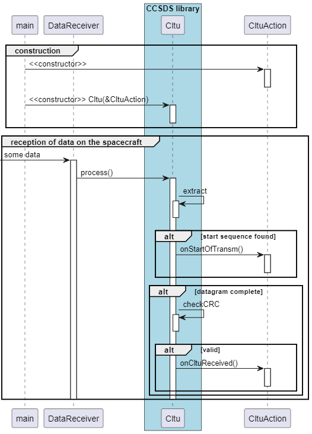
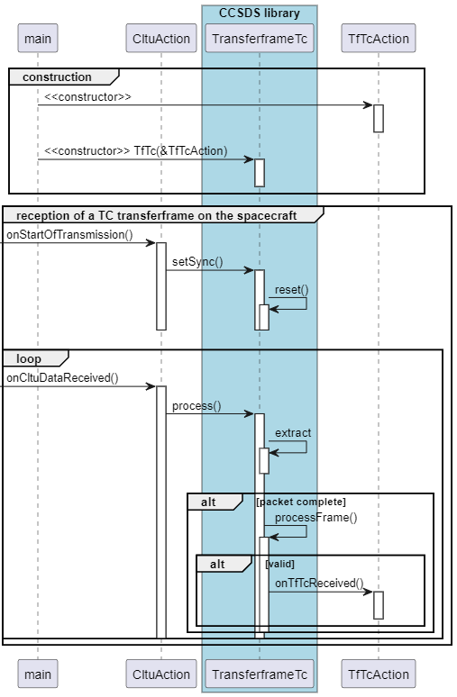
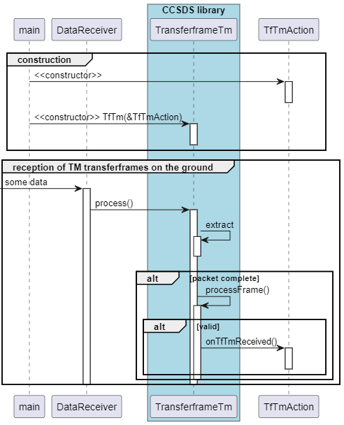
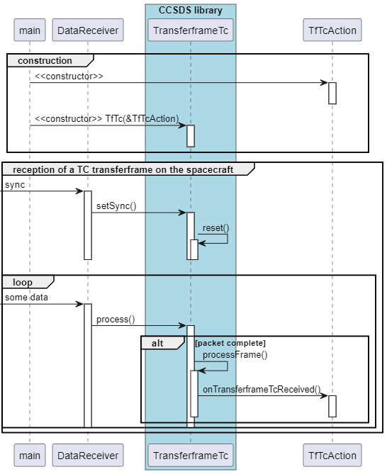

Main Page {#mainpage}
=========

# CCSDS

This is an implementation of a CCSDS compliant Transferframe and SpacePacket library as used in Satellites for transferring telecommands and data from ground to the satellite and telemetry from satellite to ground. 

## Features

* synchronisation mechanism
* data error detection
* data flow control with retransmit mechanism
* suitable for command and data transfer
* virtual channels for addressing multiple receivers via one physical channel

## Short Protocol Overview

First of all, the Consultative Committee for Space Data Systems (CCSDS) is an international organisation founded to establish common communication protocols for spacecrafts (rockets, space ships, satellites, ...) to be able to share ground stations and mission control systems. 

The protocols are described starting from the low level to the high level. 

### CLTUs

The lowest logical protocol on top of the physical layer is the Communications Link Transmission Unit (CLTU) protocol, described in the standard CCSDS 231.0 - TC synchronization and channel coding. The standard itself is available on the CCSDS web site: http://www.ccsds.org. 

CLTUs are used for transmission from ground to the spacecraft (uplink) when bit flips can occcur. 

With this protocol, The transmission is started by a 2-byte start sequence. After that, several "BCH codewords" are sent, containing 7 data bytes plus 1 error control byte. The transmission is ended by a predefined 8-byte sequence.

Usually the CLTU decoding on a real spacecraft is done by hardware. But in case there is no hardware decoding mechanism, the software implemenation can be used. 

For downlink, usually no CLTUs are used. There is also no need for using CLTUs if the underlaying data connection is reliable.   

### Transferframes for uplink

Transfer frames for uplink from the ground to the spacecraft are described in the standard CCSDS 232.0 - TC space data link protocol. They are used to address the spacecraft, to ensure the reception of all data packets (without gaps), to establish a data flow mechanism and to separare one physical communication connection into logical data channels. They are optionally embedded in CLTUs.

For uplink, the transfer frames have different sizes, depending from its content. 

### Transferframes for downlink

Transfer frames for downlink are described in the standard CCSDS 132.0 - TM Space Data Link Protocol. They have a fixed size (for example 508 bytes) and are used to transfer mainly telemetry data from different sources within the spacecraft to the ground using virtual channels. 

For example, the real-time telemetry can use the virtual channel 0, recorded historical telemetry can use virtual channel 1, and payload data can be sent via other virtual channels. 

The transfer frame can also include an Operational Control Field (OCF), which usually holds the Communications Link Control Word (CLCW) used for flow control.

Usually, each downlink transferframe is sent after a synchronization pattern, which is described in the standard 131.b - TM Synchronization and Channel Coding in detail. On spacecrafts, usually everytime transfer frames are sent. If no transferframe with data is ready for beeing sent, an idle transferframe is sent on virtual channel 7 instead.  

### SpacePackets

SpacePackets are described in the standard CCSDS 133.0 - Space Packet Protocol. They are used to structurize the data in up- and downlink.

Each spacepacket has an application ID, which is responsible for the interpretation of the content. For example, the APID 0x48 can be used to identify housekeeping data from the satellite. Also for uplink there are usually several applications responsible for different tasks. The spacepackets can have different sizes and are usually embedded in transferframes. A transferframe for downlink can hold one spacepacket, but it can also hold several spacepackets or parts of a large spacepacket. Same is valid for uplink, but since uplink transfer frames can have a variable size, usually one uplink transferframe contains exactly one spacepacket.

### PUS telecommands

The usage of telecommands contained in spacepackets is described in the ECSS-E-70 Packet Utilization Standard (PUS). 

A command is identified by a service and a subservice number. There are some service, which are prededefined in the standard. Also status reports (for example Telecommand acceptance reports) can be requested with this protocol. Some parts of the packet should be placed in the secondary header of the spacepacket.  

## Integration

TODO

## Usage

TODO

### Sequence Diagram for CLTU extraction on the spacecraft

### Sequence Diagram for TC TransferFrame extraction on the spacecraft

### Sequence Diagram for TM TransferFrame extraction on the ground

### Sequence Diagram for SpacePacket extraction

## API

See 

## Diagrams

### Class Diagram CLTU

This diagram illustrates the Cltu class.

### Class Diagram Spacepacket

This diagram illustrates the Spacepacket class.

### Class Diagram TransferFrame + CLCW

This diagram illustrates the TransferFrame classes.

The Transferframe Operational Control Field (OCF) can carry the Communications Link Control Word (CLCW) used for flow control. This diagram illustrates the CLCW class.

## Limitations

Limitations of Transferframes (Telemetry):                                                 
* The TM secondary header is not supported                 
* Randomization is not supported

## Known Anomalies

* none

## Changelog

### 1.0.0

Initial release

## Website

Further information can be found on [GitHub](https://github.com/steftri/CCSDS).

