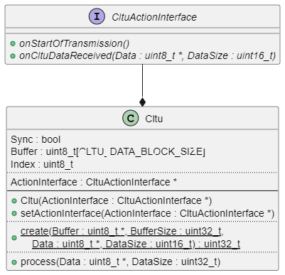
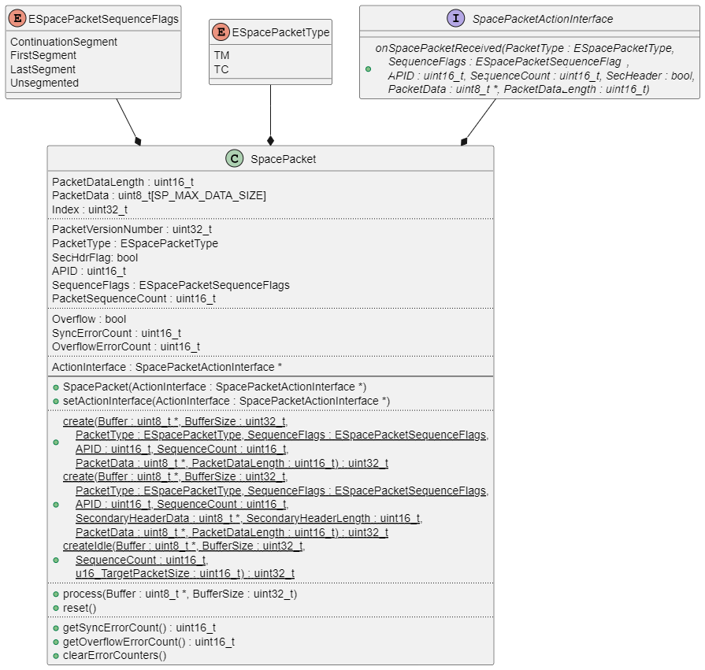
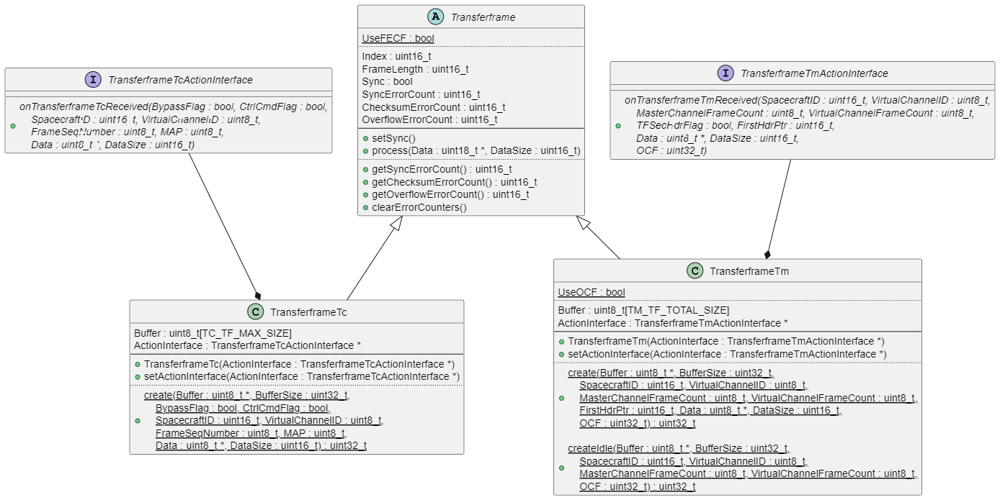
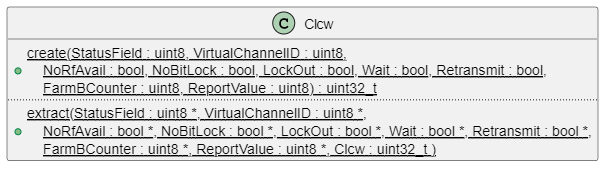

# CCSDS

This is an implementation of a CCSDS compliant Transferframe and SpacePacket library as used in Satellites for transferring telecommands and data from ground to the satellite and telemetry from satellite to ground. 

## General

This is a beta release

## Features

TODO

## Short Protocol Overview

TBD

### CLTUs

### Transferframes

### Space Packets

## Integration

TODO

## Usage

TODO

## API

### Setup

TODO

### Operation

TODO

## Diagrams

### Class Diagram CLTU

This diagram illustrates the Cltu class.

### Class Diagram Spacepacket

This diagram illustrates the Spacepacket class.

### Class Diagram TransferFrame + CLCW

This diagram illustrates the TransferFrame classes.

As OCF, the CLCW can be used. This diagram illustrates the CLCW class.

## Limitations

Limitations of Transferframes (Telemetry):                                                 
* The TM secondary header is not supported                 
* Randomization is not supported

Limitations of SpacePackets:
* CCSDS secondary header format is not supported 

## Known Anomalies

* none

## Changelog

### 1.0.0

Initial release

## Website

Further information can be found on [GitHub](https://github.com/steftri/CCSDS).

