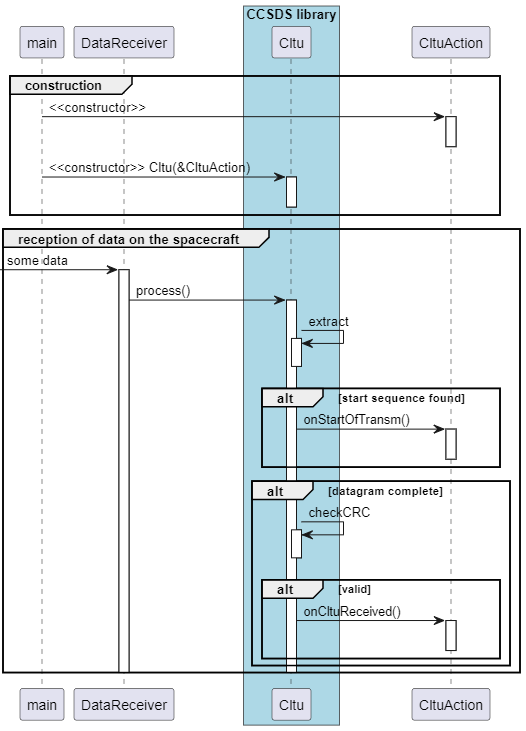
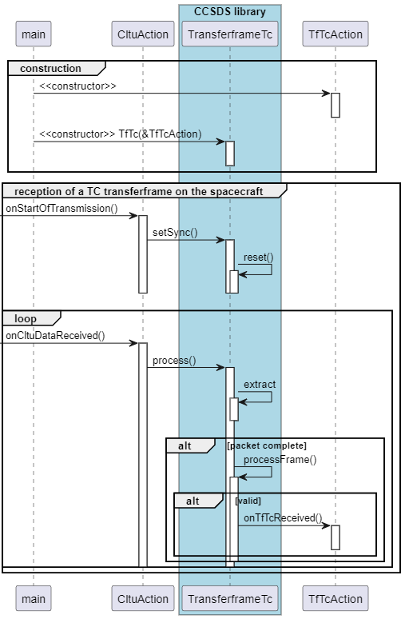
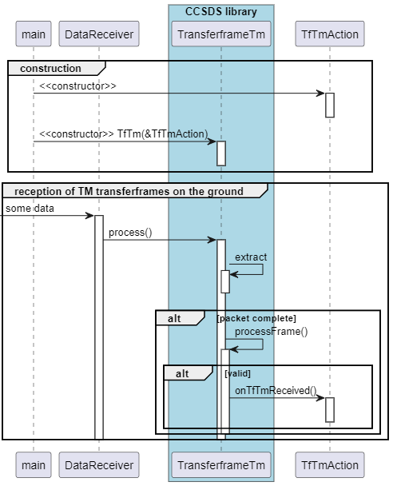
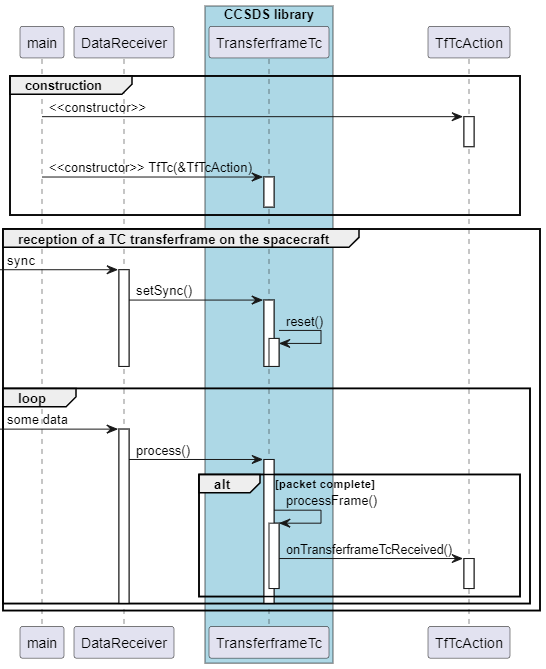
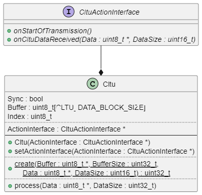
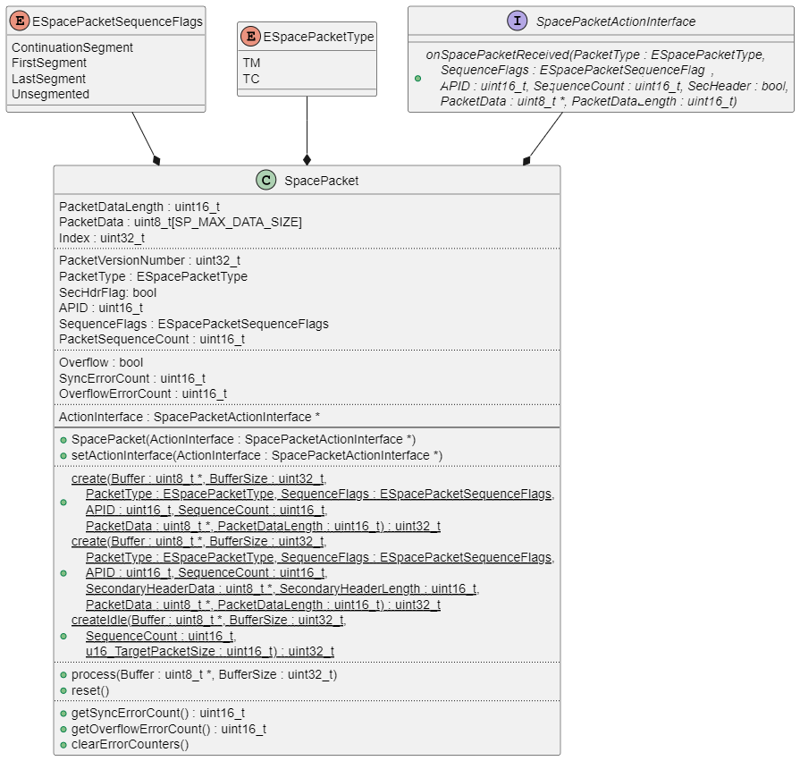
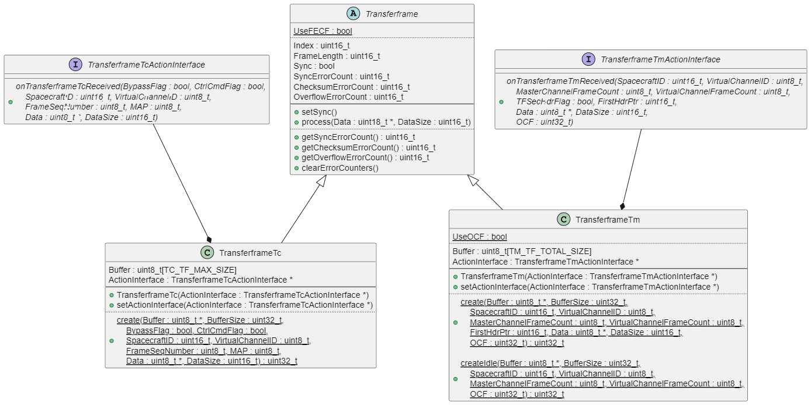
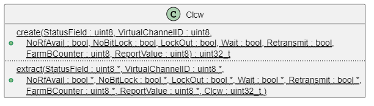

# CCSDS

This library implements CCSDS-compliant Transfer Frames and Space Packets as used in satellites for uplink telecommands/data and downlink telemetry.

## Features

* synchronization mechanism
* data error detection
* data flow control with retransmission mechanism
* suitable for command and data transfer
* virtual channels for addressing multiple receivers via one physical channel

## Short Protocol Overview

The Consultative Committee for Space Data Systems (CCSDS) is an international organization that defines common communication protocols for spacecraft (rockets, spacecraft, satellites, etc.) to enable sharing of ground stations and mission control systems.

The protocols are typically described from lower to higher layers.

### CLTUs

The lowest logical protocol on top of the physical layer is the Communications Link Transmission Unit (CLTU) protocol, described in CCSDS 231.0 (TC Synchronization and Channel Coding). The standard is available on the CCSDS website: http://www.ccsds.org.

CLTUs are used for uplink transmission (ground to spacecraft), especially when bit errors can occur.

With this protocol, transmission starts with a 2-byte start sequence. After that, several BCH codewords are sent, each containing 7 data bytes plus 1 error control byte. Transmission ends with a predefined 8-byte sequence.

On real spacecraft, CLTU decoding is usually done in hardware. If no hardware decoder is available, this software implementation can be used.

For downlink, CLTUs are usually not used. CLTUs are also not required if the underlying data connection is already reliable.

### Transferframes for uplink

Transfer Frames for uplink (ground to spacecraft) are described in CCSDS 232.0 (TC Space Data Link Protocol). They are used to address the spacecraft, ensure reception of all packets (without gaps), provide flow control, and separate one physical communication link into logical data channels. They can optionally be embedded in CLTUs.

For uplink, Transfer Frames have variable sizes depending on their content.

### Transferframes for downlink

Transfer Frames for downlink are described in CCSDS 132.0 (TM Space Data Link Protocol). They have a fixed size (for example 508 bytes) and are used to transfer mainly telemetry data from different spacecraft sources to ground, using virtual channels.

For example, real-time telemetry can use virtual channel 0, recorded historical telemetry can use virtual channel 1, and payload data can use other virtual channels.

The transfer frame can also include an Operational Control Field (OCF), which usually holds the Communications Link Control Word (CLCW) used for flow control.

Usually, each downlink Transfer Frame is sent after a synchronization pattern described in CCSDS 131.0 (TM Synchronization and Channel Coding). On spacecraft, frames are sent continuously; if no data frame is available, an idle frame is sent on virtual channel 7.


### SpacePackets

Space Packets are described in CCSDS 133.0 (Space Packet Protocol). They structure application data for uplink and downlink.

Each Space Packet has an Application Process Identifier (APID) that defines how its content is interpreted. For example, APID 0x48 can identify housekeeping data. Uplink typically also uses multiple APIDs for different applications/tasks.

Space Packets can have variable sizes and are usually embedded in Transfer Frames. A downlink Transfer Frame can carry one Space Packet, multiple Space Packets, or fragments of a large Space Packet. The same is true for uplink, but because uplink Transfer Frames have variable size, one uplink Transfer Frame often contains exactly one Space Packet.


### PUS telecommands

The usage of telecommands contained in Space Packets is described in the ECSS Packet Utilization Standard (PUS).

A command is identified by service and subservice numbers. Some services are predefined in the standard. Status reports (for example, telecommand acceptance reports) can also be requested. Some command fields are placed in the Space Packet secondary header.


## Integration

TODO


## Configuration

All compile-time settings are defined in `configCCSDS.h` and can be overridden at compile time without modifying the library. Pass the flag via the compiler command line (e.g. with `-D`) or — in PlatformIO — via `build_flags` in `platformio.ini`.

### Available Build Flags

| Flag | Default | Description |
|------|---------|-------------|
| `CCSDS_SP_MAX_DATA_SIZE` | `496` | Maximum size of the Space Packet data field in bytes (up to 65535 per standard) |
| `CCSDS_TC_TF_MAX_SIZE` | `508` | Maximum TC Transfer Frame size in bytes (without sync; max 1024 per CCSDS 232.0-B-3) |
| `CCSDS_TM_TF_TOTAL_SIZE` | `508` | Fixed TM Transfer Frame size in bytes (without sync) |
| `CCSDS_TF_USE_OCF` | `1` | Include Operational Control Field (OCF / CLCW) in TM frames (`0` to disable) |
| `CCSDS_TF_USE_FECF` | `1` | Include Frame Error Control Field (CRC) in Transfer Frames (`0` to disable) |
| `CCSDS_TF_TC_USE_SEG_HDR` | `1` | Include Segment Header (MAP ID) in TC Transfer Frames (`0` to disable) |

### Example: PlatformIO

```ini
[env:myboard]
build_flags =
    -DCCSDS_TM_TF_TOTAL_SIZE=1024
    -DCCSDS_TC_TF_MAX_SIZE=256
    -DCCSDS_TF_USE_OCF=0
```

### Example: Arduino UNO (memory-constrained)

For platforms with very limited RAM, replace `configCCSDS.h` with the provided `configCCSDS.Arduino.h` or pass reduced values directly:

```ini
build_flags =
    -DCCSDS_SP_MAX_DATA_SIZE=32
    -DCCSDS_TC_TF_MAX_SIZE=44
    -DCCSDS_TM_TF_TOTAL_SIZE=44
```


## Usage

TODO


### Sequence Diagram for CLTU extraction on the spacecraft




### Sequence Diagram for TC TransferFrame extraction on the spacecraft




### Sequence Diagram for TM TransferFrame extraction on the ground




### Sequence Diagram for SpacePacket extraction




## API

See [Doxygen documentation](doc/html/).


## Diagrams

### Class Diagram CLTU

This diagram illustrates the Cltu class.




### Class Diagram Space Packet

This diagram illustrates the SpacePacket class.




### Class Diagram TransferFrame + CLCW

This diagram illustrates the TransferFrame classes.



The Transferframe Operational Control Field (OCF) can carry the Communications Link Control Word (CLCW) used for flow control. This diagram illustrates the CLCW class.




## Limitations

Limitations of Transfer Frames (Telemetry):
* The TM secondary header is not supported                 
* Randomization is not supported


## Known Anomalies

* none


## Changelog

### 1.0.0

Initial release


## Website

Further information can be found on [GitHub](https://github.com/steftri/CCSDS).

